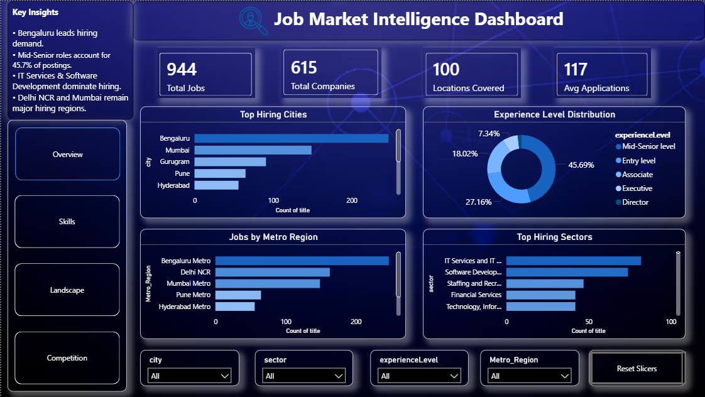

# LinkedIn Job Market Analysis Dashboard



## Project Overview

This project analyzes LinkedIn job postings to uncover hiring trends, skill demand, geographic distribution, and job market competition across India. Using Python, SQL, and Power BI, raw job posting data was transformed into an interactive business intelligence dashboard that provides actionable insights for job seekers, recruiters, and analysts.

---

## Business Problem

The modern job market generates large volumes of hiring data, making it difficult to identify:

- Which cities offer the most opportunities
- Which companies are actively hiring
- What skills are currently in demand
- Which sectors dominate recruitment
- How competitive different roles and locations are

This project addresses these questions through data cleaning, exploratory analysis, and interactive visualization.

---

## Objectives

- Analyze hiring demand across cities and metro regions
- Identify top hiring companies and sectors
- Discover the most sought-after technical skills
- Measure job market competition using application data
- Build an interactive Power BI dashboard for decision-making

---

## Tools & Technologies

| Category | Tools |
|-----------|--------|
| Data Cleaning | Python, Pandas, NumPy |
| Data Analysis | SQL |
| Visualization | Power BI |
| Dashboard Metrics | DAX |
| Reporting | GitHub |

---

## Dataset Features

The dataset contains LinkedIn job postings with information such as:

- Job Title
- Company Name
- City & State
- Sector
- Experience Level
- Contract Type
- Applications Count
- Job Description
- Posting Date

---

## Data Processing Workflow

### Python
- Data cleaning and preprocessing
- Missing value handling
- Date transformation
- Location standardization
- Skill extraction from job descriptions
- Feature engineering

### SQL Analysis
- Top hiring cities
- Top hiring companies
- Experience-level analysis
- Sector analysis
- Competition analysis
- Metro region analysis

### Power BI
- Interactive dashboard creation
- KPI development
- Data storytelling
- Drill-down analysis
- Dynamic filtering using slicers

---

# Dashboard Pages

## 1. Executive Overview

Provides a high-level summary of the job market.

### Key Metrics
- Total Jobs
- Top Hiring City
- Top Hiring Company
- Top Metro Region

### Insights
- Hiring demand across major cities
- Sector distribution
- Experience-level distribution
- Regional hiring patterns

---

## 2. Skills Intelligence

Analyzes technical skill demand across job postings.

### Key Metrics
- Most In-Demand Skill
- Top Programming Skill
- Top Cloud Skill

### Insights
- Skill demand trends
- Technology adoption patterns
- Most requested technical competencies

---

## 3. Hiring Landscape

Provides a geographic and organizational view of hiring activity.

### Key Metrics
- Leading Hiring City
- Leading Employer
- Leading Metro Region

### Insights
- Top hiring companies
- Geographic hiring distribution
- Sector-wise recruitment demand
- Contract type analysis

---

## 4. Competition Analysis

Evaluates market competitiveness using application volume.

### Key Metrics
- Average Applications per Job
- Highest Applications Received
- Total Applications
- Competition Index

### Insights
- Most competitive cities
- Most competitive sectors
- Competition across experience levels
- Most applied job roles

---

## Key Findings

- Bengaluru emerged as the leading hiring hub.
- IT and Software sectors drive recruitment demand.
- Excel, Python, SQL, and AWS are among the most sought-after skills.
- Metro regions account for the majority of job opportunities.
- Competition varies significantly across locations and experience levels.
- Certain job postings attract over 200 applications, highlighting intense market competition.

---

## Repository Structure

```text
LinkedIn-Job-Market-Analysis/
│
├── datasets/
│   └── LinkedIn_Jobs_Final.csv
│
├── notebooks/
│   └── data_cleaning.ipynb
│
├── sql/
│   ├── 01_top_hiring_cities.sql
│   ├── 02_top_companies.sql
│   ├── 03_experience_analysis.sql
│   ├── 04_sector_analysis.sql
│   ├── 05_competition_analysis.sql
│
├── powerbi/
│   └── LinkedIn_Job_Market_Analysis.pbix
│
├── screenshots/
│   ├── overview.png
│   ├── skills_analysis.png
│   ├── hiring_landscape.png
│   └── competition_analysis.png
│
└── README.md
```

---

## Skills Demonstrated

- Data Cleaning
- Exploratory Data Analysis (EDA)
- SQL Querying
- Data Modeling
- Data Visualization
- Dashboard Development
- DAX Measures
- Business Intelligence
- Insight Generation
- Data Storytelling

---

## Author

**Janhvi Mishra**

Computer Engineering Student | Data Analytics Enthusiast

**Skills:** Python • SQL • Power BI • Data Visualization • Business Intelligence

### Connect With Me

- LinkedIn: https://linkedin.com/in/janhvi-mishra-4ab72328a
- GitHub: https://github.com/janhvi-mishra-data
